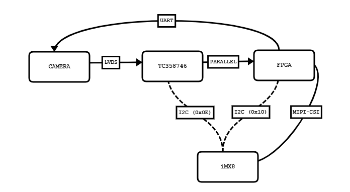

# LVI Kernel Modules Documentation

# KERNEL BASED MODULES

## lviconfig_ctrl

**File**: `lib/lviconfig/lviconfig_ctrl.c`

`lviconfig_ctrl` is a module that handles configuration parameters for the LVI camera system.
It is responsible for reading and writing configuration data to and from an on-board **EEPROM**.

This module is used indirectly by drivers that include `lviconfig_parameters.c`.

## lviconfig_parameters

**File**: `lib/lviconfig/lviconfig_parameters.c`

This module defines and stores the various configuration parameters for the LVI camera system.
The smallest building block of the configuration system is the `ConfigParam` struct:

```c
struct ConfigParam {
    const char *name;
    void       *data;
    uint8_t     type;
    uint16_t    address;
    uint16_t    size;
};
```

Only the `name` and `data` fields are typically needed when accessing a parameter from other drivers.
The remaining fields are used internally by `lviconfig_ctrl.c` to perform EEPROM read/write operations.
The driver keeps track of the data stored in the EEPROM, making sure that no unnecessary writes are performed if the new data is identical to the current data (see ConfigParam_SaveAll).

The ConfigParam can then be grouped into other structs, such as `confMonitorMode`, which holds all parameters related to that higher-level struct.

All configuration parameters are exported symbols. Drivers can access them by including the header `lviconfig_parameters.h` and accessing the structs directly.

**Example in `lcdifv3-common.c`**
```c
uint8_t brightness = *(confMonitorMode[0].Brightness.data);
```

## lvicam

**File**: `drivers/media/i2c/lvicam.c`

`lvicam` is the main driver module for the LVI camera system.

It also handles **I2C** communication with the FPGA to configure camera settings and execute functions such as zoom, artificial color mode, and others. The document `Documentation/lvi/FPGA_I2C_Register_Specification.md` breaks down how to communicate with the FPGA using i2c commands. All direct communication with the camera is handled by the FPGA using the UART protocol.

**Data flow**: Camera → LVDS → TC358746 bridge → MIPI-CSI → FPGA → processing

**Hardware schematic**:



**Kernel/user space integration**

`lvicam.h` defines IOCTL channels where you can read and write i2c data from user space applications.

```c
LVICAM_CTRL_IOCTL_READ_DATA 
LVICAM_CTRL_IOCTL_WRITE_DATA
```

Reading the `FPGA_I2C_Register_Specification.md`, you can simply define the commands in user space without ever having to edit the kernel.
This example app `Documentation/lvi/examples/lvicam_userspace_app` shows how to communicate with the lvicam driver from user space - in this case specifically by sending commands transferred from the **lvipanel**.

## lvipanel

**File**: `drivers/input/misc/lvipanel.c`

The `lvipanel.c` kernel driver is used to communicate with the LVI user panel.
This module handles commands from the panel via i2c, which can then be used in user space to control a GUI, execute camera commands, etc.

Referring to `drivers/input/misc/lvipanel_events.h`, **SYSTEM_EVENT_x** refers to events that are sent *to* the lvipanel, like lighting an LED, or setting boot states (important for keeping track of the iMX8 during boot). **PANEL_EVENT_X** refers to events that are sent *from* the lvipanel, like button presses, or encoder turns.

Events can be transferred between the lvipanel driver and userspace.
```c
#define IOCTL_READ_DATA _IOR('i', 1, char)
#define IOCTL_WRITE_DATA _IOW('i', 2, char)
```

## lvibattery

The `lvibattery.c` driver communicates with a smart battery via SMBUS (100kHz) and also controls the battery charger.
The battery and charger addresses are 0x0b and 0x09 respectively. The battery is read only and reports the state of the battery, such as charge status, chemistry, etc. The charger is writable, which enables e.g. setting charge current, etc.

Note: An user space interface `lvibattery_app` is used to set charging parameters, which is useful when testing for EMI. Reducing e.g. the charging current may also reduce emmissions from the system.

## lvirtc

**File**: `drivers/rtc/lvirtc.c`

`lvirtc` is a driver module that manages the **RTC** (Real-Time Clock) functionality in the LVI camera system.
The RTC used is a PCF85063A chip connected via i2c.

## lvipwm

**File**: `drivers/pwm/lvipwm.c`

`lvipwm` manages the voltage which is used to control the dimming of the system's LEDs. The only value that needs to be set is the *duty cycle*. This parameter ranges from 0-255 and can be set from user space using IOCTL:

```c
#define PWM_IOCTL_SET_DUTY _IOW(PWM_MAGIC, 0, unsigned long)
```

The initial duty cycle value is fetched from `lviconfig_parameters` by referring to the config parameter `confLighting`.

## Important files – Display pipeline

**File**: `drivers/gpu/imx/lcdifv3/lcdifv3-common.c`

This file contains logic for streaming and buffering data for the **LCDIFv3** interface, which ultimately drives the display.

With modifications made by LVI, this driver allows adjustment of display properties by applying a color matrix to the framebuffer. The parameters that can be adjusted are Brightness, Contrast, Saturation, and Color gains (R, G, B).

The parameters are fetched from `lviconfig_parameters`, which are then used to build the color matrix. This matrix is then applied to specific CSC (Color Space Conversion) registers of the iMX8 LCDIFv3.

**Color Space Conversion parameters**:

```c
struct lcdifv3_csc_params {
    int brightness;
    int contrast;
    int saturation;
    int r_gain;
    int g_gain;
    int b_gain;
};
```
These parameters can be modified from **userspace** via IOCTL calls.

### Troubleshooting note

If the screen remains **black** after boot:

- The EEPROM on the carrier board may be missing, not responding, or is corrupted.
- In this case the driver falls back to zero-initializing all `lcdifv3_csc_params` fields → black screen.

## ncs8801s

**File**: `drivers/video/backlight/ncs8801s.c`

Driver for the **NewCoSemi LVDS-to-eDP converter chip**.
The header file contains arrays of data that correspond to the settings given by the datasheet.

By using the `ncs8801s_configurator.exe` you can easily generate custom settings for the chip, and paste the results into the `id1_1920_1080_regs[]` array in the header file `ncs8801s.h`.

After generating a configuration file, you will be asked if the settings worked properly.
This is particularily useful if you're *experimenting* with values for a new display.

## tps55287_pmic

**File**: `drivers/power/supply/tps55287_pmic.c`

Driver for the **Texas Instruments TPS55287 PMIC**. This is used by `lvicam.c` to provide stable power to the camera and display. The output voltage of this chip can be configured in the **device tree** by setting the value of the parameter `ti,vout-microvolt` in the `tps55287` node.
